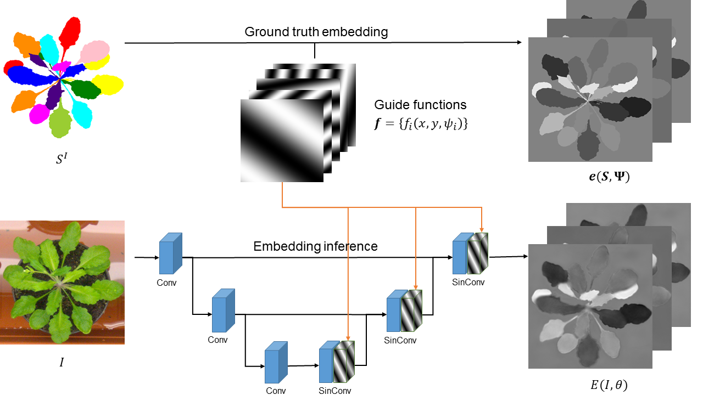

# Instance Segmentation Using Harmonic Embeddings

<p align="middle">
  
</p>

<p>
We present a new instance segmentation approach tailored to biological images, where instances may correspond to individual cells, organisms or plant parts. Unlike instance segmentation for user photographs or road scenes, in biological data object instances may be particularly densely packed, the appearance variation may be particularly low, the processing power may be restricted, while, on the other hand, the variability of sizes of individual instances may be limited. These peculiarities are successfully addressed and exploited by the proposed approach.
</p>
<p>
Our approach describes each object instance using an expectation of a limited number of sine waves with frequencies and phases adjusted to particular object sizes and densities. At train time, a fully-convolutional network is learned to predict the object embeddings at each pixel using a simple pixelwise regression loss, while at test time the instances are recovered using clustering in the embeddings space. In the experiments, we show that our approach outperforms previous embedding-based instance segmentation approaches on a number of biological datasets, achieving state-of-the-art on a popular CVPPP benchmark. Notably, this excellent performance is combined with computational efficiency that is needed for deployment to domain specialists.
</p>

## Supplementary code for the paper [Instance Segmentation of Biological Images Using Harmonic Embeddings](https://arxiv.org/abs/1904.05257).

### Prerequisites
- [PyTorch-1.0 and torchvision](https://pytorch.org/) 

### Authors:
- Victor Kulikov
- Victor Lempitsky

### Citing
If you used our research, we kindly ask you to cite the corresponding [paper](https://arxiv.org/abs/1904.05257).
```
@ARTICLE{2019arXiv190405257K,
       author = {{Kulikov}, Victor and {Lempitsky}, Victor},
        title = "{Instance Segmentation of Biological Images Using Harmonic Embeddings}",
      journal = {arXiv e-prints},
     keywords = {Computer Science - Computer Vision and Pattern Recognition},
         year = "2019",
        month = "Apr",
          eid = {arXiv:1904.05257},
        pages = {arXiv:1904.05257},
archivePrefix = {arXiv},
       eprint = {1904.05257},
 primaryClass = {cs.CV}
}
```

### Acknowledgements 

We have used the following repositories in preparation of the code:
- [Lextal](https://github.com/Lextal/pspnet-pytorch)
- [mkocabas](https://github.com/mkocabas/CoordConv-pytorch)
